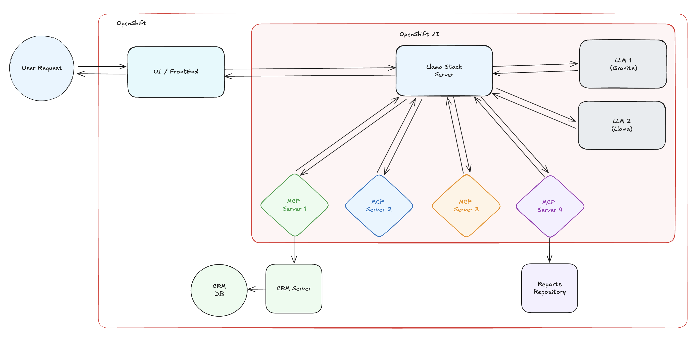
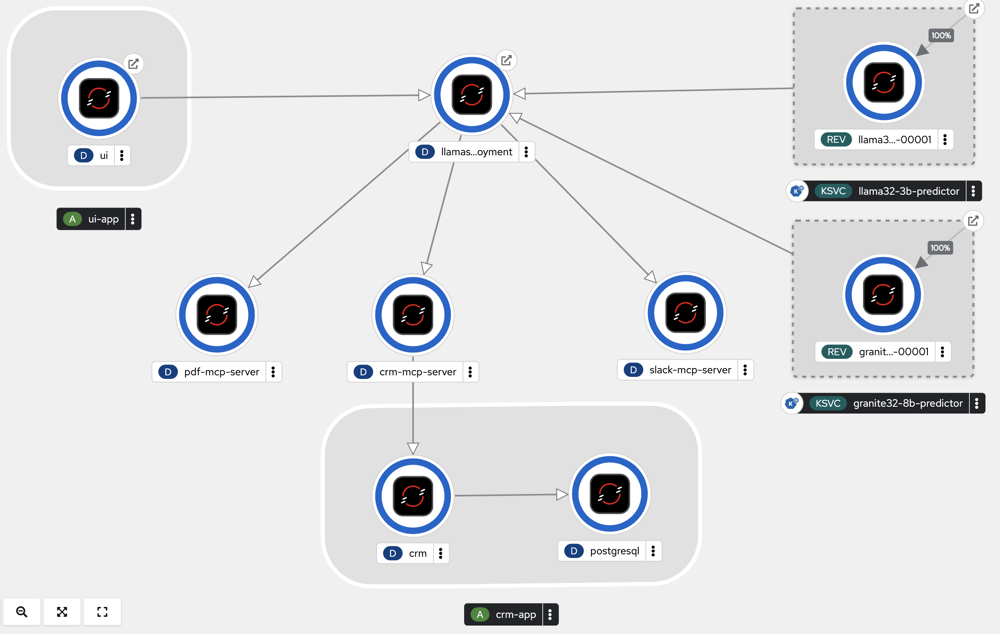
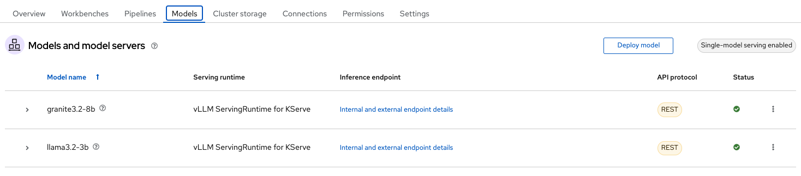

# Red Hat AI Agentic Demo

Red Hat Agentic AI Demo Repository for ParaCloud


## 🎮 Try the Demo Live!

**Check out the [Demo Arcade](https://interact.redhat.com/share/BgvP9hA8HJrkXtOQbvCj) to see this demo in action!**

Experience the full agentic AI workflow with real-time interactions across multiple systems including CRM, PDF generation, and Slack integrations.

---

*This is a work-in-progress (WIP) repository, and modifications will be made.*

## 1. Architecture

The demo architecture consists of the following components:



- **UI / Frontend**: Receives user requests and displays responses.
- **Llama-Stack Server**: Orchestrates interactions with the LLMs and MCP servers.
- **MCP Servers**: Integrate with external systems such as CRM, PDF generation, Process Reports, and Slack.
- **LLMs**: Models (Granite 3.2-8B and Llama 3.2-3B) deployed on OpenShift AI.

### 1.1 Flow Overview

1. The **UI Frontend** receives the user request.
2. The **Llama-Stack Server** processes the request, communicates with the LLMs, and selects the appropriate tools.
3. The **MCP Servers** handle interactions with CRM, PDF generation, Process Reports and Slack.
4. The **LLMs** (Granite 3.2-8B and Llama 3.2-3B) reason over the data and generate a contextualized response.
5. The **UI Frontend** displays the final response back to the user.

## 2. Setup

### 2.1 Prerequisites

* OpenShift Cluster 4.17+
* OpenShift AI 2.16+
* 2 GPUs with a minimum of 24GiB VRAM each
    * Supports both NVIDIA and Intel Habana Gaudi GPUs :)

### 2.2 Deploy the demo in OpenShift / OpenShift AI

To deploy the demo on your OpenShift environment:

```sh
# Set namespace variable
export NAMESPACE=rhai-agentic-demo
```

**Default deployment (with local GPU inference):**
```sh
# Create namespace first
oc create namespace $NAMESPACE

# Deploy to namespace
oc apply -k kubernetes/deploy-demo/overlays/default
```

**Don't have GPUs in your cluster? Want to use MaaS (Models as a Service)?**

See [MaaS configuration guide](./docs/maas.md) for setup instructions.

```sh
# Create namespace first
oc create namespace $NAMESPACE

# Deploy to namespace
oc apply -k kubernetes/deploy-demo/overlays/maas
```

### 2.3 Access the Demo

After deployment, get the UI route to access the demo:

```sh
# Get the demo UI URL
oc get route -n $NAMESPACE ui --template='https://{{.spec.host}}{{"\n"}}'

# Or get route with grep
oc get route -n $NAMESPACE | grep ui
```

Access the demo using the URL from the route output.

The demo topology diagram in OpenShift is the following:



and the LLMs used in this demo deployed in OpenShift AI are the following:



### 2.2 Deploy the demo locally

If you prefer to run the demo locally for development or testing purposes, follow the instructions in the [local deployment guide](./docs/deploy-demo-local.md)

## 3. Sample Requests

Here are some example prompts to interact with the system:

```
Review the current opportunities for ACME corp
Get a list of support cases for the account
Determine the status of the account, e.g. unhappy, happy etc. based on the cases
Generate a PDF document with a summary of the support cases and the account status.
Send a summary of the account plus a link to download the pdf via slack to the general channel
```